# Schema Design Decisions

Design rationale for the Compound database schema. Each decision is numbered for easy reference.

## Entity Relationship Diagram

```mermaid
erDiagram
    exercises {
        INTEGER id PK
        TEXT uuid UK
        TEXT name
        TEXT muscle_group
        TEXT equipment
        TEXT tracking_type
        TEXT notes
        INTEGER is_custom
        TIMESTAMP created_at
        TIMESTAMP updated_at
        TIMESTAMP deleted_at
    }

    programs {
        INTEGER id PK
        TEXT uuid UK
        TEXT name
        TEXT description
        INTEGER is_template
        INTEGER is_prebuilt
        TIMESTAMP created_at
        TIMESTAMP updated_at
        TIMESTAMP deleted_at
    }

    program_workouts {
        INTEGER id PK
        TEXT uuid UK
        INTEGER program_id FK
        TEXT name
        INTEGER day_number
        INTEGER sort_order
        TIMESTAMP created_at
        TIMESTAMP updated_at
    }

    sections {
        INTEGER id PK
        TEXT uuid UK
        INTEGER program_workout_id FK
        TEXT name
        INTEGER sort_order
        INTEGER rest_seconds
        TIMESTAMP created_at
        TIMESTAMP updated_at
    }

    section_exercises {
        INTEGER id PK
        TEXT uuid UK
        INTEGER section_id FK
        INTEGER exercise_id FK
        INTEGER target_sets
        INTEGER target_reps
        REAL target_weight
        INTEGER target_duration
        REAL target_distance
        INTEGER sort_order
        TEXT notes
        TIMESTAMP created_at
        TIMESTAMP updated_at
    }

    progression_rules {
        INTEGER id PK
        TEXT uuid UK
        INTEGER section_exercise_id FK
        TEXT strategy
        REAL increment
        REAL increment_pct
        INTEGER deload_threshold
        REAL deload_pct
        TIMESTAMP created_at
        TIMESTAMP updated_at
    }

    cycles {
        INTEGER id PK
        TEXT uuid UK
        INTEGER program_id FK
        TEXT status
        TIMESTAMP started_at
        TIMESTAMP completed_at
        TIMESTAMP created_at
        TIMESTAMP updated_at
    }

    sessions {
        INTEGER id PK
        TEXT uuid UK
        INTEGER cycle_id FK
        INTEGER program_workout_id FK
        INTEGER sort_order
        TEXT status
        TIMESTAMP started_at
        TIMESTAMP completed_at
        TEXT notes
        TIMESTAMP created_at
        TIMESTAMP updated_at
    }

    set_logs {
        INTEGER id PK
        TEXT uuid UK
        INTEGER session_id FK
        INTEGER exercise_id FK
        INTEGER section_exercise_id FK
        INTEGER set_number
        INTEGER target_reps
        INTEGER actual_reps
        REAL weight
        INTEGER duration
        REAL distance
        REAL rpe
        TIMESTAMP completed_at
        TIMESTAMP created_at
    }

    idempotency_keys {
        INTEGER id PK
        TEXT key UK
        TEXT method
        TEXT path
        INTEGER status
        TEXT response
        TIMESTAMP created_at
        TIMESTAMP expires_at
    }

    programs ||--o{ program_workouts : "has"
    program_workouts ||--o{ sections : "has"
    sections ||--o{ section_exercises : "has"
    section_exercises }o--|| exercises : "references"
    section_exercises ||--o| progression_rules : "has"
    programs ||--o{ cycles : "runs as"
    cycles ||--o{ sessions : "has"
    sessions }o--|| program_workouts : "mirrors"
    sessions ||--o{ set_logs : "has"
    set_logs }o--|| exercises : "references"
    set_logs }o--o| section_exercises : "references"
```

## 1. Templates & Programs → Single `programs` Table

**Decision:** Merge templates and programs into one `programs` table with an `is_template` flag.

**Rationale:** Templates and programs are structurally identical — same workouts, sections, and exercises. A separate `templates` table would duplicate the entire hierarchy. "Create from template" is simply a deep copy of a program where `is_template = true`.

- `is_template = 1` — reusable blueprint, appears in template listings
- `is_template = 0` — user's active program
- `is_prebuilt = 1` — shipped with the app (5/3/1, PPL, Starting Strength)

## 2. Rest Periods → `rest_seconds` on `sections`

**Decision:** Drop the `rest_periods` table. Add `rest_seconds INTEGER` to the `sections` table.

**Rationale:** Rest is simply "how long to rest after this section completes." A separate table with nullable `after_section_id` / `after_exercise_id` foreign keys was over-engineered for the MVP. A single column on sections covers the primary use case. Per-exercise rest can be added later if needed.

## 3. Sections → Freeform Name Only

**Decision:** No type enum for sections. Just a `name TEXT` field.

**Rationale:** Users name sections whatever they want: "Heavy Compounds", "Accessory Work", "Burnout Finisher", "Warm-Up". An enum would either be too restrictive or grow endlessly. Freeform names are simpler and more flexible.

## 4. Exercise Tracking Modes → `tracking_type` on `exercises`

**Decision:** Add `tracking_type TEXT NOT NULL DEFAULT 'weight_reps'` to the `exercises` table.

**Values:**
- `weight_reps` — barbell/dumbbell lifts (default)
- `bodyweight_reps` — pull-ups, push-ups (reps only, no weight)
- `duration` — planks, carries (time in seconds)
- `distance` — running, rowing (distance value)

**Rationale:** Different exercises need different tracking fields. The tracking type on the exercise determines which fields are relevant in `section_exercises` (targets) and `set_logs` (actuals). This avoids confusion about which columns to fill.

## 5. Weight Progression → Separate `progression_rules` Table

**Decision:** Create a dedicated `progression_rules` table linked to `section_exercises`.

**Rationale:** Progression logic varies by exercise placement — the same exercise might progress differently in two programs. Storing rules per `section_exercise` (not per `exercise`) allows this flexibility.

**Strategies:**
- `linear` — fixed increment (e.g., +5 lbs per successful session)
- `percentage` — percentage increase (e.g., +2.5%)
- `wave` — wave loading (for 5/3/1 style periodization)

**Deload:** After N consecutive failures (`deload_threshold`), reduce weight by `deload_pct`.

## 6. IDs → Dual Strategy (Integer + UUID)

**Decision:** `INTEGER PRIMARY KEY AUTOINCREMENT` for performance, plus a `uuid TEXT UNIQUE NOT NULL` indexed column on every table.

**Rationale:**
- Integer PKs are faster for joins and indexing in SQLite
- UUIDs enable future sync across devices and API stability
- Internal queries join on integer IDs
- External/API references can use UUIDs

## 7. Cycles → Manual Restart

**Decision:** Users explicitly start a new cycle. No auto-repeat, no cycle numbering.

**Rationale:** Auto-repeating cycles add complexity (when to trigger, what if the user wants to modify the program first). Manual restart is simple and predictable. Cycle numbering can be derived from query order if needed later.

## 8. Sessions → Pre-Generated

**Decision:** All sessions are created when a cycle starts. `sort_order` mirrors the workout's `day_number`.

**Rationale:** Pre-generating sessions lets users see upcoming workouts, complete them in any order, and skip sessions. Status field (`pending`, `in_progress`, `completed`, `skipped`) tracks progress through the cycle.

## 9. Muscle Group & Equipment → Single Primary Value

**Decision:** One `muscle_group` and one `equipment` value per exercise. No junction tables.

**Rationale:** Filtering by primary target is good enough for the MVP. A bench press is "chest" even though it also works triceps and shoulders. Multi-muscle tagging can be added later with a junction table if needed.

## 10. Soft Deletes

**Decision:** `deleted_at INTEGER` (nullable unix ms) on `exercises` and `programs`. Queries filter `WHERE deleted_at IS NULL`.

**Rationale:** Historical set logs reference exercises and programs. Hard deleting would break those references or require cascading deletes that destroy workout history. Soft deletes preserve data integrity while hiding deleted items from active listings.

**Tables with soft delete:** `exercises`, `programs`
**Tables without:** Everything else cascades from programs or is immutable log data.

## 11. Timestamps → ISO 8601 Text, All UTC

**Decision:** All timestamps stored as `TIMESTAMP` (ISO 8601 text, e.g. `2026-03-01T12:00:00Z`). All times in UTC.

**Rationale:** ISO 8601 text is human-readable, sorts lexicographically, and avoids unix epoch ambiguity (seconds vs milliseconds). SQLite's built-in date/time functions work natively with ISO 8601 strings. UTC avoids timezone bugs — the client converts to local time for display.

**Convention:**
- Every table gets `created_at TIMESTAMP NOT NULL`
- Mutable tables also get `updated_at TIMESTAMP NOT NULL` (set to `created_at` on insert, updated on every write)
- `set_logs` is append-only — `created_at` only, no `updated_at`
- Domain event timestamps (`started_at`, `completed_at` on cycles/sessions) are separate from metadata timestamps (`created_at`, `updated_at`)
- `idempotency_keys` is append-only — `created_at` only, no `updated_at`

## 12. Idempotency Keys → Separate Table, Lazy Expiry

**Decision:** Store idempotency key records in an `idempotency_keys` table. Expired keys are filtered out on read — no background cleanup job.

**Columns:**
- `key` — the client-provided `Idempotency-Key` header value (unique)
- `method` + `path` — stored to detect misuse: same key on a different endpoint returns 422
- `status` — HTTP status code, replayed as-is on duplicate requests
- `response` — full JSON response body blob, useful for debugging and correct replay
- `expires_at` — `created_at + 24h`; lookup query filters `WHERE expires_at > now()`

**Rationale:** Lazy filtering avoids a background job. At single-user scale, stale rows accumulate slowly and have no meaningful performance impact. Storing the full response body enables exact replay and aids debugging when clients retry unexpectedly.
